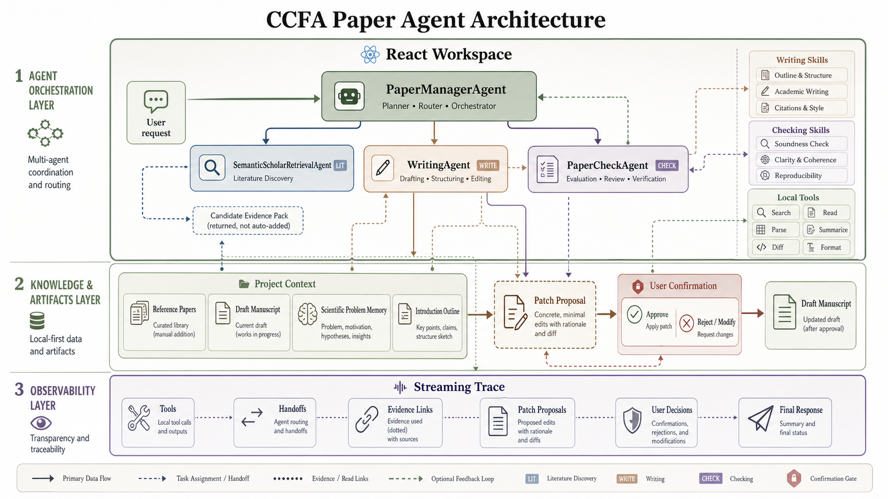

<div align="center">


# CCFA Paper Agent

**A local-first multi-agent workspace for CCF-A / SCI paper writing, checking, retrieval, and confirmed manuscript editing.**

[English](README.md) | [中文](README.zh-CN.md) | [Usage Guide](docs/USAGE.zh-CN.md) | [Updates](docs/UPDATES.md)


</div>

---



---

## System Profile

| Layer | Stack | Role |
| --- | --- | --- |
| Frontend | React, Vite, TypeScript, Tailwind CSS | Local paper workspace, chat threads, file panels, patch review, streaming trace |
| Backend | FastAPI, OpenAI Agents SDK, DeepSeek-compatible model adapter | Agent orchestration, handoff routing, tool execution, JSON response contract |
| Agents | `PaperManagerAgent`, `WritingAgent`, `PaperCheckAgent`, `SemanticScholarRetrievalAgent` | Writing, checking, retrieval, evidence gathering, and controlled patch generation |
| Local data | Markdown drafts, MinerU-parsed PDFs, reference papers, figures, phrase memory, IndexedDB state, optional local workspace path | Project-centered manuscript context and recoverable local state |
| Safety boundary | Tool-generated patches plus frontend confirmation | No silent file overwrite; every manuscript edit is reviewable before application |

## What It Is

CCFA Paper Agent is not a generic chatbot. It treats a paper as a living research artifact: drafts, reference papers, image assets, paragraph status, Introduction outlines, scientific problem memory, retrieval results, and manuscript patches are all part of one local project.

The system is built around agent handoffs. `PaperManagerAgent` routes the request, `WritingAgent` writes and revises manuscript content, `PaperCheckAgent` performs review-style diagnosis, and `SemanticScholarRetrievalAgent` provides candidate evidence through an agent-as-tool interface.

## Core Capabilities

- **Project-centered paper workspace**: manage draft manuscripts, core references, optional references, figures, project metadata, paragraph states, Introduction outlines, and scientific problem memory.
- **Writing agent with skills**: section-aware writing skills for Introduction, Method, Result, Abstract, title design, and scientific problem phrasing.
- **Checking agent with skills**: review-style checks for Introduction quality, evidence sufficiency, sentence logic, concept alignment, tone, and revision cost.
- **MinerU PDF parsing**: automatically parse paper PDFs with MinerU and organize them into precise Markdown files for downstream reading, retrieval, and evidence grounding.
- **Reference-grounded generation**: prefer local drafts, verified project context, and curated references over unsupported free-form text.
- **Semantic Scholar retrieval**: open search, citation expansion, and reference expansion return candidate papers for user confirmation.
- **Dynamic phrase memory**: accumulate useful academic phrases, strong sentence patterns, and reusable wording during agent runs, then save them locally for future writing.
- **Confirm-before-write editing**: edit tools emit structured patches; the frontend displays diffs and waits for user approval.
- **Streaming observability**: tool calls, handoffs, intermediate progress, patch proposals, and final responses can be displayed in real time.
- **Local-first credentials**: DeepSeek, Semantic Scholar, and MinerU keys stay in the backend `.env`.

## Agent Architecture

### `PaperManagerAgent`

The coordinator. It interprets the user request, inspects compact project context, and decides whether to answer directly or hand off to a specialist agent.

### `WritingAgent`

The manuscript authoring agent. It reads the relevant writing skill before drafting or revising, checks scientific problem memory, uses local drafts and references, and emits patch proposals when file edits are requested.

### `PaperCheckAgent`

The manuscript checking agent. It reads checking skills, locates the target paragraph or sentence, inspects paragraph status, checks references and project alignment, and returns evidence-based review findings. It does not edit the draft unless the user explicitly confirms patch generation.

### `SemanticScholarRetrievalAgent`

The literature discovery agent exposed through `retrieve_academic_papers`. It returns candidate papers and evidence packs, but never automatically adds them to the local reference library.

## Quick Start

### Requirements

- Python 3.10+; the startup scripts validate this and accept newer Python 3 versions
- Node.js 20+
- Chrome or Edge; Safari is not recommended because local directory access is incomplete
- DeepSeek API key

### Windows

Run from the repository root:

```powershell
.\start-local.ps1
```

You can also double-click:

```text
start-local.bat
```

If PowerShell blocks script execution:

```powershell
powershell -ExecutionPolicy Bypass -File .\start-local.ps1
```

### macOS / Linux

Run from the repository root:

```bash
chmod +x ./start-local.sh
./start-local.sh
```

Notes for macOS users:

- The script accepts Python 3.10 or newer. If `python3.10` is unavailable, it uses `python3` only when that interpreter is also `>= 3.10`.
- Use Chrome or Edge for the local workspace. Safari may fail when creating or opening a project folder because this app depends on the File System Access API.
- On first use, click **Create Paper Project**. **Open Existing Project** is only for a previously created CCFA Paper Agent project folder containing `.agent/project-state.json`.
- If the configuration panel shows `Failed to fetch` or cannot connect to the backend, open `http://127.0.0.1:8000/health` and check whether `start-local.sh` completed successfully.

The script installs dependencies, prepares the backend environment, starts FastAPI at `http://127.0.0.1:8000`, starts Vite at `http://127.0.0.1:5173`, and opens the local workspace.

## Configuration

Fill in local API credentials from the frontend configuration panel, or edit:

```text
ccfa-paper-agent-backend/.env
```

| Key | Required | Purpose |
| --- | --- | --- |
| `DEEPSEEK_API_KEY` | Yes | Drives the backend agents |
| `DEEPSEEK_MODEL` | Yes | Chat model used by the agent runner |
| `SEMANTIC_SCHOLAR_API_KEY` | Optional | Improves Semantic Scholar rate limits |
| `MINERU_API_TOKEN` | Optional | Enables PDF parsing into Markdown |

Never commit real API keys. The local `.env` file is ignored by Git.

## Project Workflow

1. Create or open a local paper project.
2. Upload draft Markdown, reference PDFs or Markdown files, and figures.
3. Parse reference PDFs with MinerU when needed.
4. Add reference metadata, core-reference labels, and Semantic Scholar paper IDs.
5. Maintain the Introduction outline and scientific problem memory.
6. Ask the agent system to write, check, retrieve, revise, or generate patch proposals.
7. Review proposed file changes in the frontend before applying them to local files.

## Repository Structure

```text
.
├── ccfa-paper-agent-backend/      FastAPI backend, agents, tools, prompts, skills
├── ccfa-paper-agent-frontend/     React local workspace
├── output/imagegen/               README and documentation visuals
├── 设计文档管理/                   Project design notes
├── start-local.ps1                Windows one-click startup
├── start-local.bat                Windows double-click startup
├── start-local.sh                 macOS / Linux one-click startup
├── README.md                      English project overview
└── README.zh-CN.md                Chinese project overview
```

## Development

Backend sanity check:

```bash
cd ccfa-paper-agent-backend
python -m compileall app
```

Frontend build:

```bash
cd ccfa-paper-agent-frontend
npm run build
```

Manual backend start:

```bash
cd ccfa-paper-agent-backend
uvicorn app.main:app --reload --host 127.0.0.1 --port 8000
```

Manual frontend start:

```bash
cd ccfa-paper-agent-frontend
npm run dev -- --host 127.0.0.1 --port 5173
```

## Local Data And Privacy

- Project files stay in the local folder selected by the user.
- Runtime API keys are stored in `ccfa-paper-agent-backend/.env`.
- Browser project state can be restored from `.agent/project-state.json`.
- Agent edits are proposed as patches and require user confirmation.
- Candidate retrieval results are not automatically written into the reference library.

## License

No license has been declared yet. Add a license before distributing or accepting external contributions.
