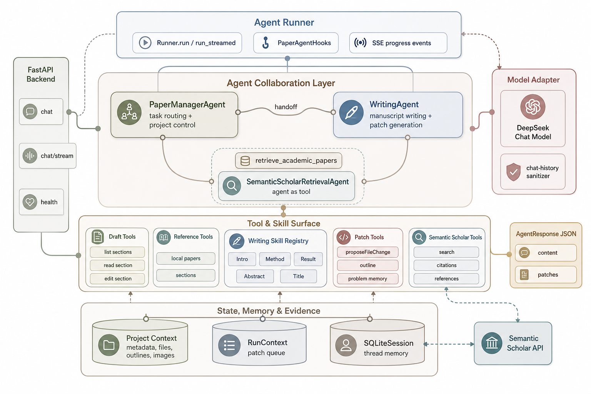

# CCFA Paper Agent


[English](README.md) | [中文](README.zh-CN.md)

**CCFA Paper Agent** is a local-first multi-agent workspace for research paper writing, revision, and literature-grounded manuscript editing.

It is designed for the real workflow behind CCF-A / SCI-style academic writing: organizing drafts, reference papers, figures, section plans, scientific problem memory, literature retrieval results, and controlled manuscript patches in one project-centered environment.

Unlike a generic chatbot, CCFA Paper Agent treats a paper as an evolving research artifact. It reads project context, selects section-specific writing skills, retrieves candidate evidence when the local corpus is insufficient, generates reviewable patches, and asks the user to confirm every file change before it is applied.

## Highlights

- **Project-centered writing workspace**: manage drafts, reference papers, image assets, project metadata, paragraph status, Introduction outlines, and scientific problem memory.
- **Multi-agent backend**: `PaperManagerAgent` coordinates the task, `WritingAgent` handles manuscript writing, and `SemanticScholarRetrievalAgent` works as a retrieval agent wrapped as a tool.
- **Reference-grounded writing**: the agent prefers local drafts, verified project materials, and curated reference papers instead of unsupported free-form generation.
- **Confirm-before-write patches**: manuscript edits are returned as structured patches and reviewed by the user before touching local files.
- **Writing skill registry**: section-aware skills for Introduction, Method, Result, Abstract, title design, and scientific problem phrasing.
- **Semantic Scholar retrieval**: search, citation expansion, and reference expansion help discover candidate papers when evidence is missing.
- **Streaming trace**: the frontend can display agent progress, tool calls, handoffs, and final responses in real time.
- **Local-first API key storage**: DeepSeek, Semantic Scholar, and MinerU credentials stay in the local backend `.env`.

## Architecture



## Agent System

**PaperManagerAgent** is the control agent. It interprets the user request, inspects project context, decides whether to answer directly or hand off to `WritingAgent`, and coordinates retrieval, project tools, and patch generation.

**WritingAgent** owns academic manuscript work. It reads the relevant writing skill before drafting or revising, checks the scientific problem memory, uses local drafts and references, and emits structured edit patches when a manuscript change is needed.

**SemanticScholarRetrievalAgent** is exposed through `retrieve_academic_papers`. It chooses among open search, citation expansion, and reference expansion, then returns candidate papers for user confirmation. Retrieval results are recommendations only; they are not automatically written into the reference library.

## What The System Can Do

- Revise, polish, rewrite, or extend manuscript sections.
- Generate Introduction paragraph outlines and maintain them as project state.
- Track scientific problems, innovations, and key technologies as writing constraints.
- Read draft sections, paragraphs, paragraph status, and reference-paper sections.
- Propose full-section or paragraph-level manuscript edits.
- Maintain and inspect reusable writing-skill files.
- Search Semantic Scholar for related papers, citations, and foundational references.
- Parse reference-paper PDFs with MinerU and preserve Markdown plus image assets.

## Quick Start

### Requirements

- Python 3.10+
- Node.js 20+
- Chrome or Edge
- DeepSeek API key

### Windows

Run from the repository root:

```powershell
.\start-local.ps1
```

You can also double-click:

```text
start-local.bat
```

If PowerShell blocks script execution:

```powershell
powershell -ExecutionPolicy Bypass -File .\start-local.ps1
```

### macOS / Linux

Run from the repository root:

```bash
chmod +x ./start-local.sh
./start-local.sh
```

The startup script installs dependencies, prepares the backend environment, starts the FastAPI backend at `http://127.0.0.1:8000`, starts the Vite frontend at `http://127.0.0.1:5173`, and opens the local workspace.

## Configuration

Fill in local API credentials from the frontend configuration panel, or edit:

```text
ccfa-paper-agent-backend/.env
```

| Key | Required | Purpose |
| --- | --- | --- |
| `DEEPSEEK_API_KEY` | Yes | Drives `PaperManagerAgent` and `WritingAgent` |
| `DEEPSEEK_MODEL` | Yes | Chat model used by the backend agent runner |
| `SEMANTIC_SCHOLAR_API_KEY` | Optional | Improves Semantic Scholar rate limits |
| `MINERU_API_TOKEN` | Optional | Enables PDF parsing into Markdown |

Never commit real API keys. The local `.env` file is ignored by Git.

## Project Workflow

1. Create or open a local paper project.
2. Upload draft Markdown, reference PDFs or Markdown files, and figures.
3. Parse reference PDFs with MinerU when needed.
4. Add reference metadata, core-reference labels, and Semantic Scholar paper IDs.
5. Maintain the Introduction outline and scientific problem memory.
6. Chat with the paper agent for revision, writing, title design, retrieval, and patch generation.
7. Review proposed file changes in the frontend before applying them to local files.

## Repository Structure

```text
.
├── ccfa-paper-agent-backend/      FastAPI backend, agents, tools, services
├── ccfa-paper-agent-frontend/     React frontend workspace
├── output/imagegen/               Generated project visuals for README/docs
├── 设计文档管理/                   Project planning and design notes
├── start-local.ps1                Windows one-click startup
├── start-local.bat                Windows double-click startup
├── start-local.sh                 macOS / Linux one-click startup
├── README.md                      English project overview
└── README.zh-CN.md                Chinese project overview
```

## Development

Backend sanity check:

```bash
cd ccfa-paper-agent-backend
python -m compileall app
```

Frontend build:

```bash
cd ccfa-paper-agent-frontend
npm run build
```

Manual backend start:

```bash
cd ccfa-paper-agent-backend
uvicorn app.main:app --reload --host 127.0.0.1 --port 8000
```

Manual frontend start:

```bash
cd ccfa-paper-agent-frontend
npm run dev -- --host 127.0.0.1 --port 5173
```

## Roadmap

- Candidate-paper cards with one-click reference-library import.
- DOI, arXiv ID, and Semantic Scholar Corpus ID recognition.
- Retrieval deduplication and venue-aware ranking.
- Evaluation agents for structure, claim-evidence alignment, and full-paper review.
- Automatic open-access PDF download followed by MinerU parsing after user confirmation.
- A public demo video or GIF for the repository landing page.

## Local Data & Privacy

CCFA Paper Agent is designed as a local-first writing workspace.

- Project files stay in the local folder selected by the user.
- Runtime API keys are stored in `ccfa-paper-agent-backend/.env`.
- Browser project state can be restored from `.agent/project-state.json`.
- Agent edits are proposed as patches and require user confirmation.
- Candidate retrieval results are not automatically written into the reference library.

## License

No license has been declared yet. Add a license before distributing or accepting external contributions.
