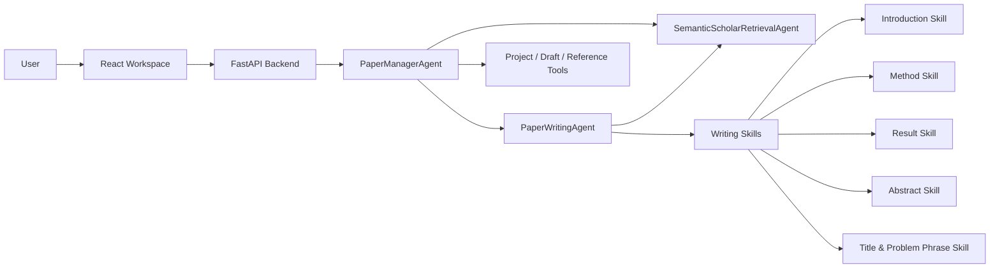

# CCFA Paper Agent


一个面向 CCF-A / SCI 英文论文写作的本地 Agent 工作台。

CCFA Paper Agent 不是简单的聊天窗口，而是一个围绕“论文工程”组织起来的写作系统：它会管理初稿、参考论文、图片、段落状态、Introduction 大纲、科学问题记忆、学术检索结果，并通过 PaperManagerAgent、WritingAgent 和 SemanticScholarRetrievalAgent 协同完成论文写作、润色、改写和选题措辞设计。

## Highlights

- 本地论文工程管理：初稿、核心参考论文、可参考论文、图片和项目状态集中管理。
- Academic Writing Agent：支持 Introduction、Method、Result、Abstract、标题与科学问题短语等写作技能。
- Reference-grounded Writing：优先利用本地参考论文和项目材料，避免凭空写作。
- Semantic Scholar Retrieval Agent：当本地语料不足时，可检索候选论文供用户确认。
- MinerU PDF Parsing：上传参考论文 PDF 后自动解析为 Markdown，并保留图片资源。
- Draft Patch Review：Agent 修改初稿时生成待确认 patch，用户确认后才写入文件。
- Streaming Process Trace：实时展示 Agent 思考与工具调用过程，完成后仍可回看。
- Local-first Key Storage：DeepSeek、Semantic Scholar、MinerU 等 Key 仅保存到本机 `.env`。

## Preview

当前项目包含一个完整的本地 Web 工作台：

- 前端：React + TypeScript + Vite + Tailwind
- 后端：FastAPI + OpenAI Agents SDK compatible workflow
- 模型：DeepSeek API compatible chat completions
- 本地文件：基于浏览器 File System Access API

建议使用 Chrome 或 Edge 打开前端页面。Safari 对本地目录读写能力支持不完整。

## Quick Start

### Requirements

- Python 3.10+
- Node.js 20+
- Chrome / Edge
- DeepSeek API Key

### Windows

在项目根目录运行：

```powershell
.\start-local.ps1
```

也可以直接双击：

```text
start-local.bat
```

如果 PowerShell 阻止脚本执行：

```powershell
powershell -ExecutionPolicy Bypass -File .\start-local.ps1
```

### macOS / Linux

在项目根目录运行：

```bash
chmod +x ./start-local.sh
./start-local.sh
```

脚本会自动完成：

- 创建或复用后端虚拟环境 `.venv310`
- 复制 `ccfa-paper-agent-backend/.env.example` 为本地 `.env`
- 安装后端依赖
- 安装前端依赖
- 启动后端 `http://127.0.0.1:8000`
- 启动前端 `http://127.0.0.1:5173`
- 打开前端主页

## API Key Configuration

首次进入主页后，在“本地 API 配置”中填写自己的 Key：

| 配置项 | 是否必需 | 用途 |
| --- | --- | --- |
| DeepSeek API Key | 必需 | 驱动 PaperManagerAgent / WritingAgent |
| DeepSeek Model | 必需 | 默认 `deepseek-v4-pro`，可在主页或 `.env` 中调整 |
| Semantic Scholar API Key | 可选 | 学术论文检索，未填写时仍会尝试匿名请求 |
| MinerU API Token | 可选 | PDF 精准解析 |

这些配置只会保存到本机：

```text
ccfa-paper-agent-backend/.env
```

`.env` 已被 `.gitignore` 忽略。不要把真实 API Key 写入 `.env.example` 或提交到仓库。

## Agent Architecture



### PaperManagerAgent

主控 Agent，负责理解用户请求、检查工程上下文、决定直接处理还是 handoff 到 WritingAgent，并管理项目工具调用。

### PaperWritingAgent

写作 Agent，负责英文 CCF-A / SCI 论文的写作、改写、润色、标题设计、科学问题短语凝练和结构优化。

### SemanticScholarRetrievalAgent

检索 Agent，负责在本地参考论文不足时调用 Semantic Scholar，返回候选论文。检索结果不会自动加入参考库，必须由用户确认。

## Writing Skills

写作 Agent 会根据任务选择对应 skill，并先读取该 skill 的 `SKILL.md`：

| Skill | 适用任务 |
| --- | --- |
| `writing-introduction-skill` | Introduction、motivation、gap、problem formulation、contribution framing |
| `writing-method-skill` | Method、framework、module、algorithm、loss、training、inference |
| `writing-result-skill` | Experiment、result、ablation、comparison、visualization、discussion |
| `writing-abstract-skill` | Abstract |
| `writing-title-problem-phrase-skill` | 标题、小标题、方法名、问题名、科学问题短语 |

核心原则：

- 用户信息用于提供方向，不直接当作论文英文语料。
- 有参考论文和语料时，优先最小化改动地迁移可用表达。
- 没有充分语料时，不强行写作，应先检索或向用户说明缺口。
- 已 finalized / locked 的段落不会被修改，除非用户明确授权。

## Project Workflow

1. 创建或打开本地论文工程。
2. 上传初稿 Markdown、参考论文 PDF / Markdown、实验图片等材料。
3. 使用 MinerU 将参考论文 PDF 解析为 Markdown。
4. 填写参考论文元信息、核心参考标记、Semantic Scholar Paper ID。
5. 维护 Introduction 大纲和科学问题记忆。
6. 与 Paper Agent 对话，进行写作、润色、标题设计、检索和 patch 生成。
7. 在前端确认 Agent 生成的文件修改，再写回本地工程。

## Manual Start

### Windows Backend

```powershell
cd ccfa-paper-agent-backend
.\.venv310\Scripts\Activate.ps1
pip install -r requirements.txt
uvicorn app.main:app --reload --host 127.0.0.1 --port 8000
```

### Windows Frontend

```powershell
cd ccfa-paper-agent-frontend
npm install
npm run dev -- --host 127.0.0.1 --port 5173
```

### macOS / Linux Backend

```bash
cd ccfa-paper-agent-backend
python3.10 -m venv .venv310
source .venv310/bin/activate
pip install -r requirements.txt
uvicorn app.main:app --reload --host 127.0.0.1 --port 8000
```

### macOS / Linux Frontend

```bash
cd ccfa-paper-agent-frontend
npm install
npm run dev -- --host 127.0.0.1 --port 5173
```

## Repository Structure

```text
.
├── ccfa-paper-agent-backend/      FastAPI backend, agents, tools, services
├── ccfa-paper-agent-frontend/     React frontend workspace
├── 设计文档管理/                   project planning and design notes
├── start-local.ps1                Windows one-click startup
├── start-local.bat                Windows double-click startup
├── start-local.sh                 macOS / Linux one-click startup
└── README.md
```

## Local Data & Privacy

CCFA Paper Agent is designed as a local-first writing workspace.

- Project files are stored in the local project folder selected by the user.
- Runtime API keys are stored in `ccfa-paper-agent-backend/.env`.
- Browser project state can be restored from `.agent/project-state.json`.
- Agent edits are proposed as patches and require user confirmation.
- Candidate retrieval results are not automatically written into the reference library.

## Troubleshooting

### Frontend opens but Agent cannot answer

Check that the backend is running:

```text
http://127.0.0.1:8000/health
```

Then confirm the DeepSeek API Key has been filled in the homepage configuration panel.

### Port 8000 or 5173 is already occupied

Close the existing process or edit the startup script port.

### macOS cannot save or restore project folders

Use Chrome or Edge and grant directory read/write permission when prompted.

### MinerU Markdown images are missing

Keep the generated `.mineru.assets` folder next to the parsed Markdown file. When opening an existing project, the frontend will reload image assets from that folder.

## Development Notes

Recommended checks before committing:

```bash
cd ccfa-paper-agent-backend
python -m compileall app
```

```bash
cd ccfa-paper-agent-frontend
npm run build
```

## License

No license has been declared yet. Add a license before distributing or accepting external contributions.
