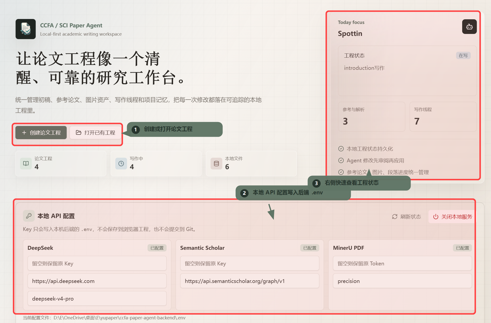
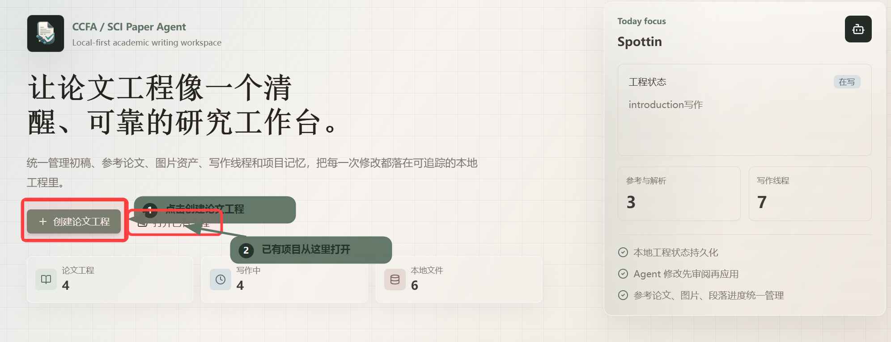
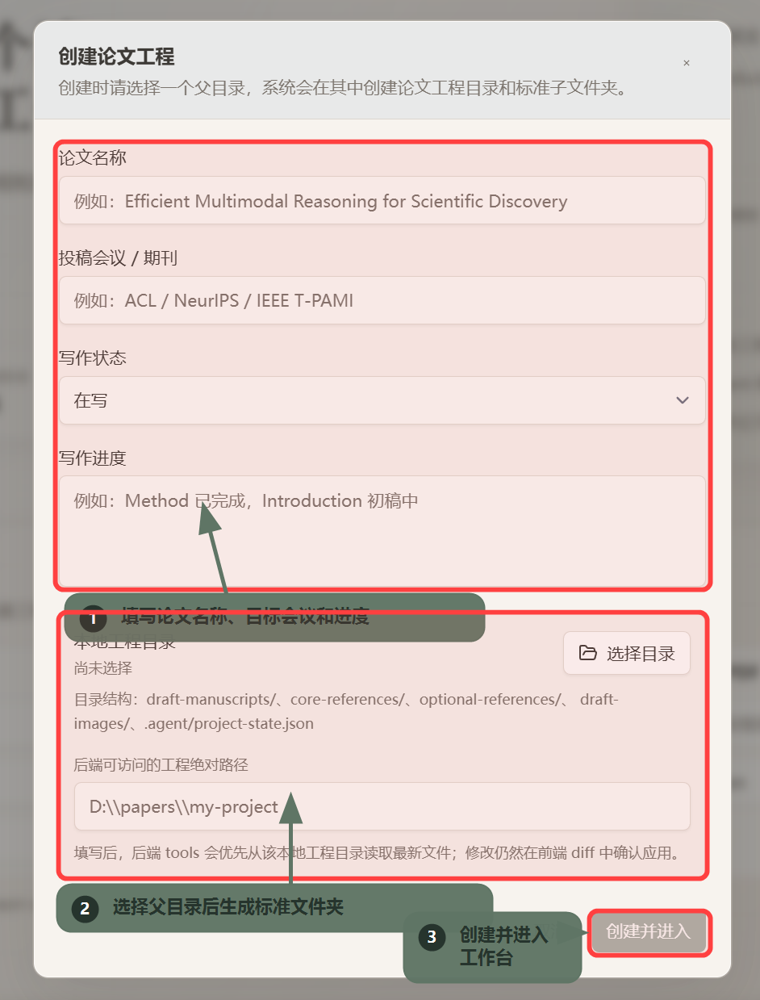
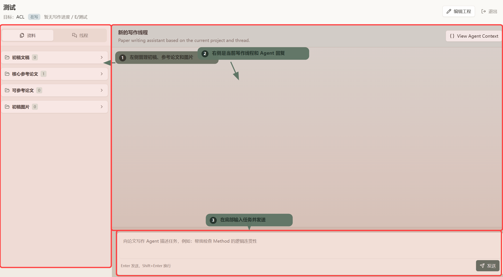
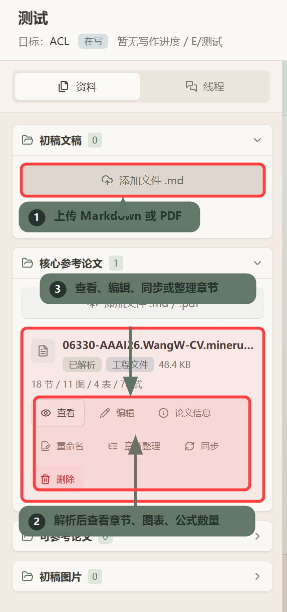
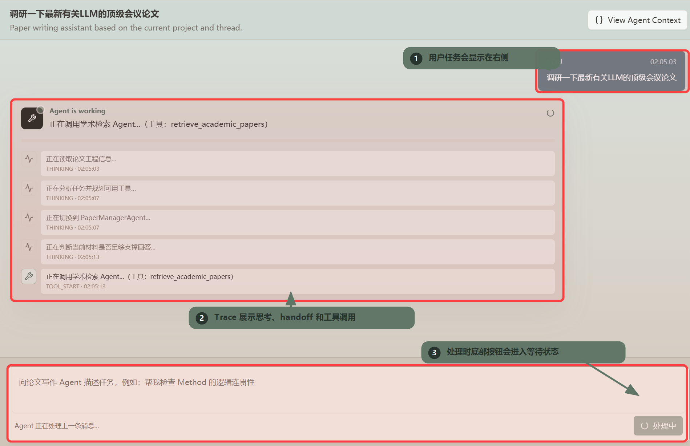

# CCFA / SCI Paper Agent 使用教程

CCFA / SCI Paper Agent 是一个本地优先的论文写作工作台。它把初稿、参考论文、图片资产、写作线程和 Agent 运行上下文放到同一个论文工程中，适合用来管理 CCF-A / SCI 论文的调研、写作、检查和可确认修改。

> 建议把本文档作为 GitHub 首页的「使用教程」章节，或在 README 中添加链接：`[使用教程](docs/USAGE.zh-CN.md)`。

## 1. 启动本地服务

准备环境：

- Python 3.10+
- Node.js 20+
- Chrome 或 Edge
- DeepSeek API Key
- 可选：Semantic Scholar API Key、MinerU API Token

Windows 在仓库根目录运行：

```powershell
.\start-local.ps1
```

也可以双击：

```text
start-local.bat
```

macOS / Linux 在仓库根目录运行：

```bash
chmod +x ./start-local.sh
./start-local.sh
```

启动后，前端默认运行在 `http://127.0.0.1:5173`，后端默认运行在 `http://127.0.0.1:8000`。

## 2. 配置本地 API



首次进入首页后，先完成本地 API 配置：

- `DeepSeek`：填写 Key、Base URL 和模型名，用于驱动后端 Agent。
- `Semantic Scholar`：可选，填写后可以提升学术检索限额。
- `MinerU PDF`：可选，填写 Token 后可以把 PDF 自动解析成 Markdown。

这些 Key 只会写入后端的 `.env` 文件，不会保存到浏览器工程，也不会提交到 Git。配置完成后，可以点击「刷新状态」检查后端是否已经读取到最新配置。

## 3. 创建或打开论文工程



如果是第一次使用，点击「创建论文工程」。如果已经有工程，点击「打开已有工程」，选择之前的本地工程目录即可继续。



创建工程时需要填写：

- 论文名称：例如 `Efficient Multimodal Reasoning for Scientific Discovery`
- 投稿会议 / 期刊：例如 `ACL`、`NeurIPS`、`IEEE T-PAMI`
- 写作状态：例如「在写」「检查中」「待投稿」
- 写作进度：例如 `Method 已完成，Introduction 初稿中`
- 本地工程目录：选择一个父目录，系统会在其中创建标准工程文件夹

工程目录会包含这些核心结构：

```text
draft-manuscripts/       初稿 Markdown
core-references/         核心参考论文
optional-references/     可参考论文
draft-images/            初稿图片资产
.agent/project-state.json
```

如果你希望后端 tools 优先从本地路径读取最新文件，可以填写「后端可访问的工程绝对路径」。之后 Agent 读取资料、同步文件、生成 patch 时都会围绕这个工程目录工作。

## 4. 进入工作台



工作台主要分成两块：

- 左侧「资料」面板：管理初稿文稿、核心参考论文、可参考论文和初稿图片。
- 右侧「线程」面板：和论文写作 Agent 对话，查看回答、工具调用、上下文和执行状态。

底部输入框用于向 Agent 发送任务。你可以直接描述目标，例如：

```text
帮我检查 Method 的逻辑连贯性
```

```text
基于核心参考论文，帮我起草 Introduction 的第一版
```

```text
调研一下最近有关 LLM 推理能力评测的顶级会议论文
```

## 5. 上传和管理资料



在「资料」页可以分别维护不同类型的文件：

- 初稿文稿：上传 `.md` 文件，作为论文正文草稿。
- 核心参考论文：上传 `.md` 或 `.pdf`，用于重点支撑写作。
- 可参考论文：上传候选参考资料，供 Agent 检索和对照。
- 初稿图片：上传论文图、实验图、示意图等资产。

参考论文上传后，可以进行：

- 查看：预览 Markdown 或解析结果。
- 编辑：修正文档内容。
- 论文信息：维护标题、作者、年份、venue、Semantic Scholar Paper ID 等元信息。
- 章节整理：把解析后的内容整理成更适合 Agent 阅读的结构。
- 同步：把前端状态和本地工程文件保持一致。

PDF 论文建议先用 MinerU 解析。解析完成后，界面会显示章节数、图片数、表格数和公式数，便于判断资料是否足够完整。

## 6. 让 Agent 执行论文任务



发送任务后，Agent 会根据当前工程和线程上下文选择合适的处理方式：

- 读取工程信息和资料状态。
- 判断是否需要切换到写作、检查或学术检索 Agent。
- 调用工具，例如 `retrieve_academic_papers`。
- 在 Trace 中展示思考、handoff、工具调用和处理进度。

常用任务示例：

| 场景 | 可以这样问 |
| --- | --- |
| 学术调研 | `调研一下最新有关 LLM 顶级会议论文` |
| 初稿检查 | `帮我检查 Introduction 是否有问题动机不足的问题` |
| 段落改写 | `请把 Method 第一段改得更像 NeurIPS 论文风格` |
| 引文支撑 | `帮我找几篇可以支撑这个 claim 的论文` |
| 标题设计 | `基于当前工程，给我 10 个 ACL 风格标题` |
| 摘要写作 | `根据当前初稿和核心参考论文，写一版 Abstract` |

如果 Agent 需要修改本地文件，它会先生成可审阅的 patch。你需要在前端查看 diff，确认后才会写回本地工程文件。

## 7. 查看 Agent 上下文

在工作台右上角点击「View Agent Context」，可以查看当前线程能够访问的工程上下文。建议在开始重要写作前检查一次：

- 当前论文工程名称和目标 venue 是否正确。
- 初稿、参考论文、图片数量是否符合预期。
- 写作进度、段落状态和工程路径是否已经同步。

这样可以减少 Agent 因上下文缺失导致的泛泛回答。

## 8. 推荐工作流

1. 启动本地服务并配置 API Key。
2. 创建论文工程，填写论文名称、目标会议和写作进度。
3. 上传初稿 Markdown、核心参考论文 PDF / Markdown 和图片资产。
4. 使用 MinerU 解析 PDF，并补充论文元信息。
5. 在写作线程中让 Agent 检查、调研、起草或改写。
6. 如果 Agent 生成 patch，先审阅 diff，再确认应用。
7. 定期同步本地文件，确保工程状态和实际文件一致。

## 9. 常见问题

### API Key 会不会被提交到 Git？

不会。Key 写入后端 `.env`，该文件已被 Git 忽略。请不要把真实 Key 手动写入 README、截图或公开 issue。

### PDF 上传后为什么建议解析？

Agent 更适合读取结构化 Markdown。MinerU 可以把 PDF 中的章节、图片、表格和公式整理成更容易检索的格式，后续写作和检查会更稳。

### Agent 会直接改我的论文吗？

默认不会。涉及文件修改时，Agent 会生成 patch，并由前端展示 diff。只有用户确认后，修改才会写回本地文件。

### 什么时候使用核心参考论文，什么时候使用可参考论文？

核心参考论文用于强支撑当前论文主线，建议放最重要、最常引用的工作。可参考论文用于候选资料、补充阅读或检索扩展，避免把工程上下文塞得过重。

### 学术检索结果会自动加入参考库吗？

不会。检索 Agent 只返回候选论文和证据包，是否加入参考库由你确认。

